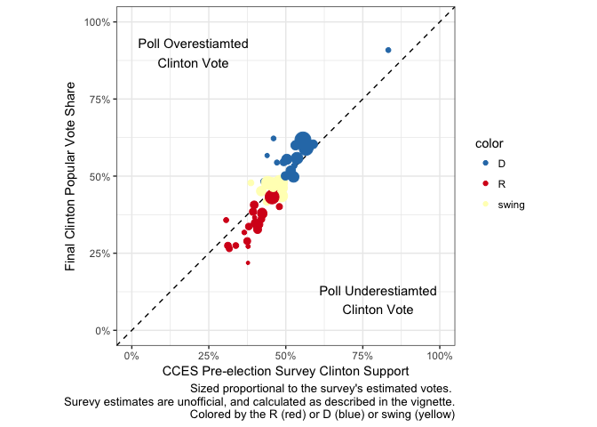
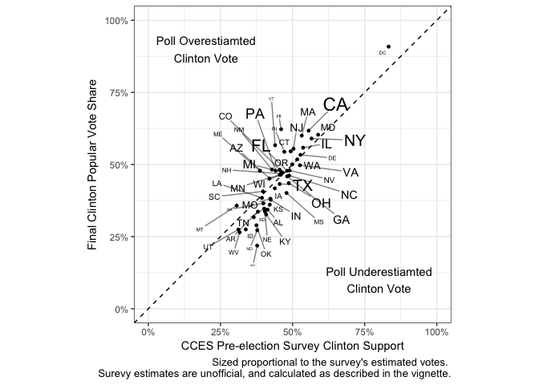
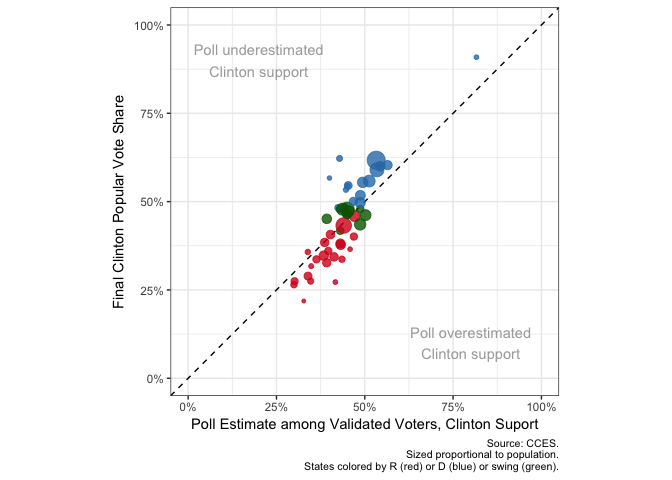
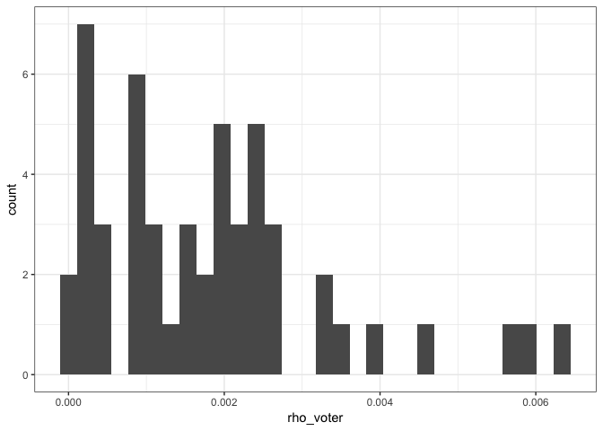
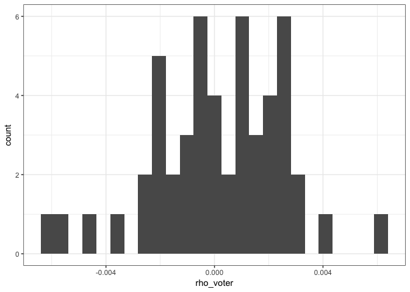
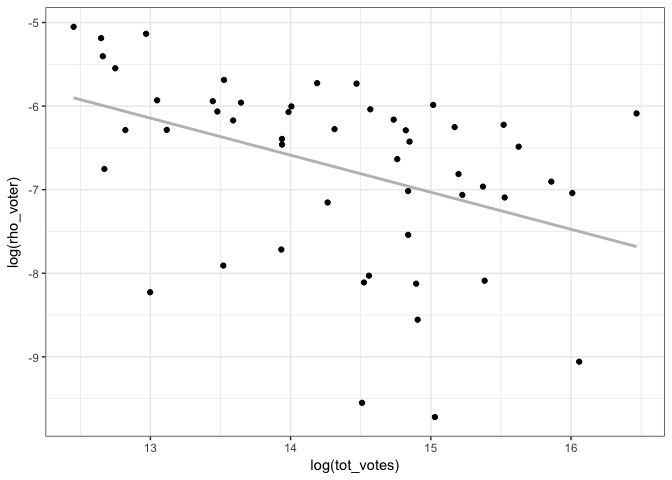

Poll Predictions and Errors
================

This data combines three state-level datasets on the 2016 Presidential Election.

Output - State Estimates
========================

The final dataset (`pres16_state.csv`) is a spreadsheet of the 50 states and DC.

``` r
read_csv("data/output/pres16_state.csv")
```

    ## # A tibble: 51 x 58
    ##                   state    st color      vap      vep votes_hrc votes_djt
    ##                   <chr> <chr> <chr>    <int>    <int>     <int>     <int>
    ##  1              Alabama    AL     R  3770142  3601361    729547   1318255
    ##  2               Alaska    AK     R   555367   519849    116454    163387
    ##  3              Arizona    AZ swing  5331034  4734313   1161167   1252401
    ##  4             Arkansas    AR     R  2286625  2142571    380494    684872
    ##  5           California    CA     D 30201571 25017408   8753788   4483810
    ##  6             Colorado    CO swing  4305728  3966297   1338870   1202484
    ##  7          Connecticut    CT     D  2821935  2561555    897572    673215
    ##  8             Delaware    DE     D   749872   689125    235603    185127
    ##  9 District of Columbia    DC     D   562329   511463    282830     12723
    ## 10              Florida    FL swing 16565588 14572210   4504975   4617886
    ## # ... with 41 more rows, and 51 more variables: tot_votes <int>,
    ## #   pct_hrc_vep <dbl>, pct_hrc_voters <dbl>, pct_djt_vep <dbl>,
    ## #   pct_djt_voters <dbl>, cces_n_raw <int>, cces_n_voters <dbl>,
    ## #   cces_n_vv <int>, cces_n_post_voters <int>, cces_tothrc_raw <int>,
    ## #   cces_tothrc_raw_post <int>, cces_tothrc_adj_trn <dbl>,
    ## #   cces_tothrc_vv <int>, cces_pct_hrc_raw <dbl>, cces_pct_hrc_vep <dbl>,
    ## #   cces_pct_hrc_voters <dbl>, cces_pct_hrc_voters_post <dbl>,
    ## #   cces_pct_hrc_vv <dbl>, cces_totdjt_raw <int>,
    ## #   cces_totdjt_raw_post <int>, cces_totdjt_adj_trn <dbl>,
    ## #   cces_totdjt_vv <int>, cces_pct_djt_raw <dbl>, cces_pct_djt_vep <dbl>,
    ## #   cces_pct_djt_voters <dbl>, cces_pct_djt_voters_post <dbl>,
    ## #   cces_pct_djt_vv <dbl>, cv_turnout_wgt <dbl>, yougov_pct_hrc <dbl>,
    ## #   yougov_pct_djt <dbl>, yougov_n <dbl>, rho_hrc_vot <dbl>,
    ## #   rho_hrc_vep <dbl>, rho_hrc_vvt <dbl>, rho_hrc_pst <dbl>,
    ## #   rho_djt_vot <dbl>, rho_djt_vep <dbl>, rho_djt_vvt <dbl>,
    ## #   rho_djt_pst <dbl>, neff_hrc_vot <dbl>, neff_hrc_vep <dbl>,
    ## #   neff_hrc_vvt <dbl>, neff_djt_vot <dbl>, neff_djt_vep <dbl>,
    ## #   neff_djt_vvt <dbl>, effratio_hrc_vot <dbl>, effratio_hrc_vep <dbl>,
    ## #   effratio_hrc_vvt <dbl>, effratio_djt_vot <dbl>,
    ## #   effratio_djt_vep <dbl>, effratio_djt_vvt <dbl>

The main columns are

Identifiers

-   `state`: Name of state (full name)
-   `st`: Name of state (abbreviation)
-   `color`: Outcome of the Race as defined by Cook Political: `R` (Republican), `D` (Democrat), `swing` (swing -- see details below.)

Outcomes (including estimates of VAP/VEP)

-   `vap`: Estimated Voting Age Population (see below for definition)
-   `vep`: Estimated Voting Eligible Population (see below for definition)
-   `votes_hrc`: Votes for Clinton
-   `votes_djt`: Votes for Trump
-   `tot_votes`: Ballots cast for the Office of President.
-   `pct_hrc_voters`: Election Outcome. Hillary Clinton's Vote as a Percentage of Ballots Cast for President. Computed by `votes_hrc / tot_votes`
-   `pct_djt_voters`: Same but with Trump
-   `pct_hrc_vep`: Hillary Clinton's Vote as a Percentage of Ballots (estimated) eligible population. Computed by `votes_hrc / vep`
-   `pct_djt_vep`: Same but with Trump

Poll estimates. Construction detailed below and in `03_tabulate_polls.R`

Denominator of sample mean

-   `cces_n_voters`: CCES sample size adjusted for estimated turnout propensity
-   `cces_n_raw`: CCES raw number of respondents, or unadjusted proxy estimate of eligible population
-   `cces_n_vv`: CCES number of respondents who matched to the 2016 voter file. This serves as the "true" voters (those who turned out) within the sample.
-   `cces_n_post_voters`: CCES number of respondents who respondend to the post-election survey *and* reported having voted in the 2016 presidential.

Numerator of sample mean

-   `cces_tothrc_adj_trn`: CCES estimated Clinton votes
-   `cces_tothrc_raw`: CCES unadjusted total Clinton votes
-   `cces_tothrc_vv`: CCES total Clinton support among validated voters.

Sample mean estimates

-   `cces_pct_hrc_voters`: CCES estimated percent of Clinton votes among voters adjusting for turnout (`cces_tothrc_adj_trn/ cces_n_voters`)
-   `cces_pct_hrc_vep`: CCES estimated percent of Clinton votes among voting eligible population (`cces_tothrc_adj_trn / cces_n_raw`)
-   `cces_pct_hrc_raw`: CCES estimated percent of Clinton votes without any adjustment (`cces_tothrc_raw/ cces_n_raw`)
-   `cces_pct_hrc_vv`: CCES estimated percent of Clinton votes among validated voters (`cces_tothrc_vv/ cces_n_vv`)
-   `cces_pct_hrc_post_voters`: CCES estimated percent of Clinton votes among those who reported voting in the post-election survey wave (`cces_tothrc_raw_post/ cces_n_post_voters`)
-   `cces_*djt*`: All same as above but with Trump

-   `cv_turnout_wgt` is the coefficient of variation on weights for each state. It is a statistic from `turnout_wgt` in `data/input/cces2016_slim.Rds`. This is used as an adjustment when calculating our parameter estimate.

Other poll

-   `yougov_pct_hrc`: YouGov estimated of Clinton votes among voters
-   `yougov_pct_djt`: Same but with Trump
-   `yougov_n`: YouGov poll sample size

Parameter Estimates

-   `rho_hrc_vot`: The *ρ* parameter with Clinton support as the quantity of interest and *voters* as the target population
-   `rho_hrc_vep`: The *ρ* parameter with Clinton support as the quantity of interest and *eligible population* as the target population
-   `rho_hrc_vvt`: The *ρ* parameter with Clinton support as the quantity of interest and *voters* as the target population, using validated voters only.
-   `rho_hrc_pst`: The *ρ* parameter with post-election Clinton support as the quantity of interest and *voters* as the target population.
-   `rho_*djt*`: The same *ρ* as above but for Trump.

-   `neff_hrc_*` is the estimated effective sample size for the appropriate sample size *n* using the specified estimator. For example, `neff_hrc_vot` is the effective sample size of `cces_n_voters` when we estimate `rho_hrc_vot`
-   `effratio_hrc_*` is the ratio of the estimated effective sample size (`neff`) over the original sample size. For example, `effratio_hrc_vot` is given by `neff_hrc_vot/cces_n_voters`
-   `neff_djt_*` and `effratio_djt*` do the same, but for Trump.

Output - Other Estimates
========================

The following tables have summary statistics and counts not incuded in the state-level dataset.

-   `pres16_US.csv` has total counts of some of the population turnout and voting data in the U.S. population.
-   `rho_sum_stats.csv` has summary statistics of the *ρ* estimates. Each column is an estimate of a type of rho for a particular type of state (or all states). Each row is a summary statistic, such as 10 percent, 90 percent quantiles, and means.

Figures
=======

Figures are named according to the following convention

-   `rho_*` is a scatter plot of a `rho` estimate on the y-axis and the target *N* on the x-axis. We take logs. `_separated` indicates facetting out cases for which `rho` is positive vs. `rho` is negative. This is an important distinction because we take the absolute value of `rho` before taking the log. `_pooled` prefix indicates that both positive and negative values are pooled. having neither of these prefixes means that they are pooled. For DJT, there was only one positive `rho`, so we remove that observation (D.C.) and show pooled.
-   `hist_*` is a histogram of state-level parameters. Mostly these are `rho`
-   `scatter_*` is a figure that has state-level estimates of a quantity ($\\widehat{\\mu}$) on the x-axis and the observed quantity (*μ*) on the y-axis.
-   `map_*` shows a quantity of interest in a simplified map (cartogram)
-   `bars_*` shows a quantity of interest in a barplot.

Data Sources
============

The data comes from three sources and is built in `01_read_data.R`

Observed Values
---------------

First, the sample space. The U.S. does not have an official census of citizens or voting *eligible* citizens. Numbers on voter registrants are also out-of-date in some states. Thus the denominator of interest is fairly tricky to compute.

Here we rely on Michael McDonald's estimates at <http://www.electproject.org/>

**Voting Age Population (VAP)** is [defined](http://www.electproject.org/home/voter-turnout/faq/denominator) as follows:

> The voting-age population, known by the acronym VAP, is defined by the Bureau of the Census as everyone residing in the United States, age 18 and older. Before 1971, the voting-age population was age 21 and older for most states.

**Voting Eligible Population (VEP)** is [defined](http://www.electproject.org/home/voter-turnout/faq/denominator) as follows:

> The voting-eligible population or VEP is a phrase I coined to describe the population that is eligible to vote. Counted among the voting-age population are persons who are ineligible to vote, such as non-citizens, felons (depending on state law), and mentally incapacitated persons. Not counted are persons in the military or civilians living overseas.

I pulled the VAP and VEP numbers from his spreadsheet [here](https://docs.google.com/spreadsheets/d/1VAcF0eJ06y_8T4o2gvIL4YcyQy8pxb1zYkgXF76Uu1s/edit#gid=2030096602).

Next, the observed election outcome. Vote counts are reported from official election reports and measured exactly. Any final count will do; I used the Cook Political Report's spreadsheet [here](https://docs.google.com/spreadsheets/d/133Eb4qQmOxNvtesw2hdVns073R68EZx4SfCnP4IGQf8).

The column `votes_hrc` refers to the column `Clinton (D)` in the above-linked spreadsheet. `tot_votes` refers to the sum of the three columns `Clinton (D)`, `Trump (R)`, and `Others`.

`color` is taken from the Color of this Cook Political's table and their classification of Swing. "Swing state" is defined as states in which:

> "Swing State" defined as state that flipped from '12 or was decided by less than 5%.

`R` and `D` are non-swing states defined by the presidential winner.

Poll Prediction
===============

The main poll we use is the CCES, which is one of the few polls that has raw data available in accessible form.

CCES
----

The Cooperative Congressional Election Study (CCES) is one of the largest pre-election studies conducted in the 2016 election. The CCES is conducted online for the several weeks before the election.

The target population is the national adult population. Sampling is continuously adjusted in a two-step process to obtain a representative sample. "Sample matching", Multi-level models and other weighting schemes contribute to the retained sample and computed weights. Quoting their guide:

> Sample matching is a methodology for selection of representative samples from non-randomly selected pools of respondents. It is ideally suited for Web access panels, but could also be used for other types of surveys, such as phone surveys. Sample matching starts with an enumeration of the target population. For general population studies, the target population is all adults, and can be enumerated through the use of the decennial Census or a high quality survey, such as the American Community Survey. In other contexts, this is known as the sampling frame, though, unlike conventional sampling, the sample is not drawn from the frame. Traditional sampling, then, selects individuals from the sampling frame at random for participation in the study. This may not be feasible or economical as the contact information, especially email addresses, is not available for all individuals in the frame and refusals to participate increase the costs of sampling in this way.

> Sample selection using the matching methodology is a two-stage process. First, a random sample is drawn from the target population. We call this sample the target sample. Details on how the target sample is drawn are provided below, but the essential idea is that this sample is a true probability sample and thus representative of the frame from which it was drawn.

> Second, for each member of the target sample, we select one or more matching members from our pool of opt-in respondents. This is called the matched sample. Matching is accomplished using a large set of variables that are available in consumer and voter databases for both the target population and the opt-in panel.

> The purpose of matching is to find an available respondent who is as similar as possible to the selected member of the target sample. The result is a sample of respondents who have the same measured characteristics as the target sample. Under certain conditions, described below, the matched sample will have similar properties to a true random sample. That is, the matched sample mimics the characteristics of the target sample. It is, as far as we can tell, representative of the target population (because it is similar to the target sample).

Using this methodology, YouGov created a target population from past ACS data. Then, they recruited online samples:

> The sample drawn for the CCES were chosen from the YouGov Panel, along with the MyPoints, Research Now, and SSI panels using a five-way cross- classification (age x gender x race x education x state). All respondents who completed the pre-election survey were re-invited to the post-election survey. The final set of completed pre-election interviews (numbering approximately 87,389, after quality controls were applied) were then matched to the target frame, using a weighted Euclidean distances metric.

The final (after sample matching) number of respondents in the [dataverse release](https://dataverse.harvard.edu/dataset.xhtml?persistentId=doi%3A10.7910/DVN/GDF6Z0) is 64,600. This differs from the 117,316 or the 84,292 numbers in the [pre-election press release](https://cces.gov.harvard.edu/news/cces-pre-election-survey-2016) because, among other reasons, in the interim the sample was culled of incomplete or bad-quality responses. There may have been adjustments to the case selection in order to achieve the qualities quoted above.

For the purposes of this project, I estimated state-level predictions without adjusting for sampling or any other covariate adjustment weights.

I did estimate voters and adjust for estimated turnout in variables `pct_hrc_voters` and `cces_n_voters`. These give a rough proxy for turnout by the coarse weights from the vote intent question. The weights are as specified in the CCES press release:

> \[A weight of\] 1 for those who have already voted, 0.9 for those "definitely voting", 0.3 for those "probably voting", and 0.1 for those not sure).

I coded other responses (No, Skipped, Missing).. to 0.

The code is in `03_tabulate_polls.R`. For simplicity I only show the estimates for the sample size and Clinton; estimates for Trump are symmetrical.

``` r
tab_cc <- cc_raw %>% 
  group_by(state) %>% 
  summarize(cces_n_raw = n(),
            cces_n_voters = sum(turnout_wgt, na.rm = TRUE),
            cces_n_vv = sum(vv_turnout, na.rm = TRUE),
            cces_tothrc_raw = sum(vote_hrc_pre, na.rm = TRUE),
            cces_tothrc_adj_trn = sum(vote_hrc_pre*turnout_wgt, na.rm = TRUE),
            cces_tothrc_vv = sum(vote_hrc_pre*vv_turnout, na.rm = TRUE),
            sd_turnout_wgt = sqrt(sum((turnout_wgt - mean(turnout_wgt))^2)/n()),
            cv_turnout_wgt = sd_turnout_wgt / mean(turnout_wgt)) %>%
  mutate(cces_pct_hrc_raw = cces_tothrc_raw / cces_n_raw,
         cces_pct_hrc_vep = cces_tothrc_adj_trn / cces_n_raw,
         cces_pct_hrc_voters = cces_tothrc_adj_trn / cces_n_voters,
         cces_pct_hrc_vv = cces_tothrc_vv / cces_n_vv)
```

YouGov Release
--------------

YouGov runs the CCES survey and generates their estimates with their algorithm. I took estimates from their November 16, 2016 press release [here](https://cces.gov.harvard.edu/news/cces-pre-election-survey-2016). A Google Sheets version of the same table in the release is [here](https://docs.google.com/spreadsheets/d/1pJLEHfvCN-eX1mBfe6sgs0dwF2oq9G1FcUhKFk0Pe8g).

Read the press release and guides (e.g. for 2014: [dataverse](https://dataverse.harvard.edu/file.xhtml?fileId=2794577&version=RELEASED&version=.0)) for more details on implementation.

Poll Estimates
==============

How do our simple state-level estimates from the CCES compare to some actual election returns?

Estimating Clinton Support
--------------------------

``` r
gg_hrc + aes(x = cces_pct_hrc_voters) +
  xlab("Turnout-adjusted Poll Estimate, Clinton Support")
```



``` r
gg_hrc + aes(x = cces_pct_hrc_raw) +
  xlab("Raw Poll Estimate, Clinton Suport")
```



``` r
gg_hrc + aes(x = cces_pct_hrc_vv) +
  xlab("Poll Estimate among Validated Voters, Clinton Suport")
```



Estimating Trump Support
------------------------

``` r
gg_djt + aes(x = cces_pct_djt_voters) +
  xlab("Turnout-adjusted Poll Estimate, Trump Support")
```



``` r
gg_djt + aes(x = cces_pct_djt_raw) +
  xlab("Raw Poll Estimate, Trump Suport")
```



``` r
gg_djt + aes(x = cces_pct_djt_vv) +
  xlab("Poll Estimate among Validated Voters, Trump Suport")
```



Estimates of *ρ*
================

We use this function for the columns `rho_*`. Input is defined in terms of its sampling target (actual votes vs. vep). We use the CCES estimates for now.

``` r
rho_estimate <- function(data = df, N, mu, muhat, n, cv = NULL) {
  
  
  N <- data[[N]]
  n <- data[[n]]
  mu <- data[[mu]]
  muhat <- data[[muhat]]
  if (!is.null(cv)) cv <- data[[cv]]
  
  ## parts
  one_over_sqrtN <- 1 / sqrt(N)
  diff_mu <- muhat - mu
  f <- n / N
  one_minus_f <- 1 - f
  s2hat <- mu * (1 - mu)
  if (!is.null(cv)) {
    A <- sqrt(1 + (cv^2 / one_minus_f))
    one_over_A <- 1 /A
  }

  
  ## estimate of rho
  if (!is.null(cv))
    return(one_over_A* one_over_sqrtN * diff_mu / sqrt((one_minus_f / n) * s2hat))
  
  if (is.null(cv))
     return(one_over_sqrtN * diff_mu / sqrt((one_minus_f / n) * s2hat))
}
```

We present two versions of this estimate based on the sampling

Based on voters
---------------

For *ρ*<sub>*H**R**C*, *v**o**t**e**r*</sub>, we use

``` r
df$rho_vot <- rho_estimate(N = "tot_votes",
                           mu = "pct_hrc_voters",
                           muhat = "cces_pct_hrc_voters",
                           n = "cces_n_voters",
                           cv = "cv_turnout_wgt")
```

Based on voting eligible population
-----------------------------------

For *ρ*<sub>*H**R**C*, *v**e**p*</sub>, we use

``` r
df$rho_vep <- rho_estimate(N = "vep",
                           mu = "pct_hrc_voters",
                           muhat = "cces_pct_hrc_raw",
                           n = "cces_n_raw")
```

Based on data from validated voters
-----------------------------------

For *ρ*<sub>*H**R**C*, *v**v**t*</sub> we use

``` r
df$rho_vvt <- rho_estimate(N = "tot_votes",
                           mu = "pct_hrc_voters",
                           muhat = "cces_pct_hrc_vv",
                           n = "cces_n_vv")
```

I did the same for Trump voters ( *ρ*<sub>*D**J**T*, *v**o**t**e**r*</sub>, *ρ*<sub>*D**J**T*, *v**o**t**e**r*</sub>, *ρ*<sub>*D**J**T*, *v**v**t*</sub>), where all estimates of Clinton were replaced with their Trump equivalents.

Figures as PDFs are in `figures`.

References
==========

-   McDonald, Michael P. 2017. "2016 November General Election" *United States Elections Project.* Accessed July 23, 2017.<http://www.electproject.org/home/voter-turnout/voter-turnout-data>
-   CCES. 2016. Press Release. <https://cces.gov.harvard.edu/news/cces-pre-election-survey-2016>
-   CCES. 2016. Data Release. <https://dataverse.harvard.edu/dataset.xhtml?persistentId=doi%3A10.7910/DVN/GDF6Z0>
-   Cook Political Report. 2017. <http://cookpolitical.com/story/10174>
